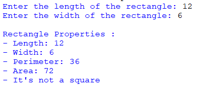
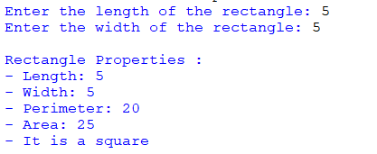

## Description
This program demonstrates the 'Rectangle' class, implementing rectangle properties such as length and width using constructor parameters. It showcases methods for calculating perimeter, area, and determining if the shape is a square.
## Examples
♡ Example 1  

  

♡ Example 2  

  
